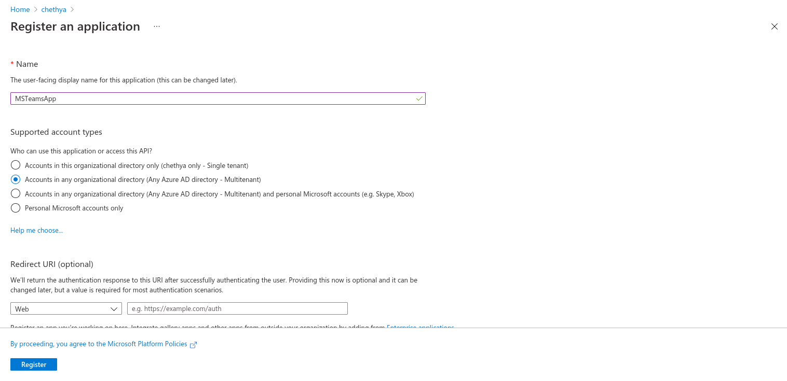
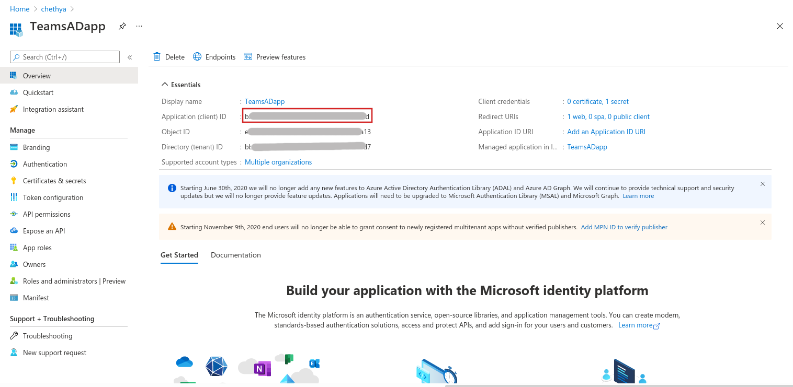
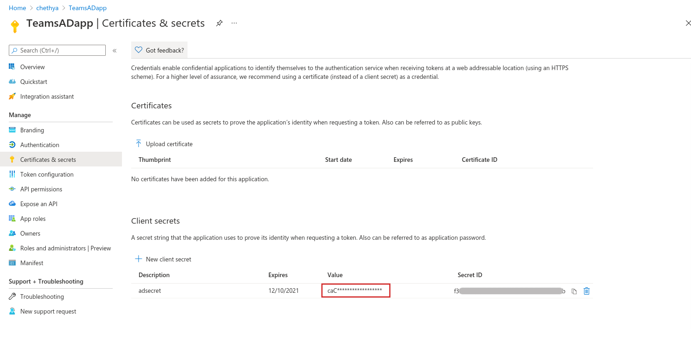
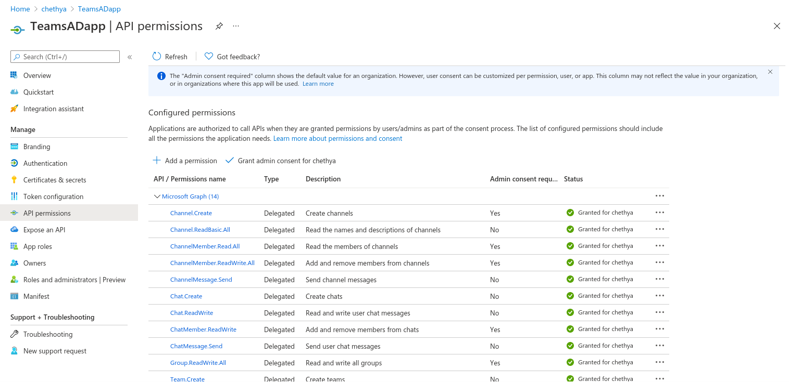
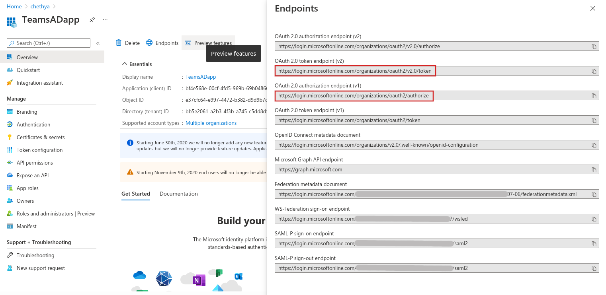

Ballerina Connector For Microsoft Teams
===================

[](https://github.com/ballerina-platform/module-ballerinax-msgraph-teams/actions?query=workflow%3ACI)
[](https://github.com/ballerina-platform/module-ballerinax-msgraph-teams/commits/master)
[](https://opensource.org/licenses/Apache-2.0)

Connects to Microsoft Teams using Ballerina.

- [Microsoft Teams Connector](#)
    - [Introduction](#introduction)
        - [What is Microsoft Teams](#what-is-microsoft-teams)
        - [Key features of Microsoft OneDrive](#key-features-of-microsoft-teams)
        - [Connector Overview](#connector-overview)
    - [Prerequisites](#prerequisites)
        - [Obtaining tokens](#obtaining-tokens)
        - [Add project configurations file](#add-project-configurations-file)
    - [Supported versions & limitations](#supported-versions-&-limitations)
    - [Quickstarts](#quickstarts)
    - [Samples](#samples)
    - [Building from the Source](#building-from-the-source)
    - [Contributing to Ballerina](#contributing-to-ballerina)
    - [Code of Conduct](#code-of-conduct)
    - [Useful Links](#useful-links)

# Introduction
## What is Microsoft Teams?
[Microsoft Teams](https://www.microsoft.com/en-ww/microsoft-teams/group-chat-software) is a chat-based collaboration 
platform complete with document sharing, online meetings, and many more extremely useful features for business 
communications. It’s included totally free with Microsoft 365 and Office 365. It’s designed to be used by local, remote 
and distributed work groups—anyone in any company. 
The true power of MS Teams comes with its rich set of features for collaboration. MS Teams API supports actions such as 
`Chats`, `Channels`, `Meetings` and `Calling`.
- **Chats** are supported as both one-on-one and group chats. Teams chat includes a host of modern messaging features, including
  text formatting, emoji and priority flagging. Users can also share files directly through chat sessions.
- **Channels** can be either Standard—public and open to everyone who wants to join—or private and focused on specific 
  topics or activities. Channel owners must authorize new users to join their channel.
- **Meetings** offers videoconferencing for up to 250 users per session. Video meetings can be scheduled on a channel’s calendar, or 
  users can create them on the fly. MS Teams offers meeting broadcasts for up to 10,000 simultaneous viewers using the Microsoft Stream integration.
- **Calls** offer the ability of outbound calling right from the client. It is an excellent way for remote or mobile users to stay 
  connected through one single, reliable connection.

    <p align="center">
    
    </p>

## Key features of Microsoft Teams
- Teams which are made up of channels, which are conversation boards between teammates.
- A chat function which can take place between teams, groups, and individuals.  
- Document storage in SharePoint, which will contain a default document library folder. 
- Online video calling and screen sharing.
- Audio conferencing where anyone can join an online meeting via phone.
- Full telephony. Microsoft  365 Business Voice can completely replace your business’ existing phone system.

## Connector Overview
Ballerina connector for Microsoft Teams is connecting to MS Teams platform API in Microsoft Graph v1.0 via Ballerina 
language easily. It provides capability to perform basic functionalities provided in MS Teams such as Sending messages, 
Viewing messages, Creating Teams, Channels and Chats, deleting and updating resources etc programmatically. 

The connector is developed on top of Microsoft Graph is a REST web API that empowers you to access Microsoft Cloud 
service resources. This version of the connector only supports the access to the resources and information of a specific 
account (currently logged in user).

# Prerequisites
- Microsoft Account
- Access to Azure Portal
- Java 11 installed - Java Development Kit (JDK) with version 11 is required
- [Ballerina SL Beta 1](https://ballerina.io/learn/user-guide/getting-started/setting-up-ballerina/installation-options/) installed 
    - Ballerina Swan Lake Beta 1 is required

## Obtaining tokens
- Create an account in MS Teams
- Sign-in to Azure Portal - App Registrations. (You should use work or school account to register the app)

- Obtaining OAuth2 credentials <br/>
    To get an access token you need to register your app with microsoft identity platform via Azure Portal. <br/>
    **(The access token contains information about your app and the permissions it has for the resources and APIs 
    available through Microsoft Graph. To get an access token, your app must be registered with the Microsoft 
    identity platform and be authorized by either a user or an administrator for access to the Microsoft Graph 
    resources it needs.)**

    Before your app can get a token from the Microsoft identity platform, it must be registered in the Azure portal. 
    Registration integrates your app with the Microsoft identity platform and establishes the information that it 
    uses to get tokens
    1. App Id
    2. Redirect URL
    3. App Secret <br/>

    **Step 1:** Register a new application in your Azure AD tenant.<br/>
    - In the App registrations page, click **New registration** and enter a meaningful name in the name field.
    - In the **Supported account types** section, select Accounts in any organizational directory (Any Azure AD 
    directory - Multi-tenant). Click Register to 
    create the application.
    - Provide a **Redirect URI** if necessary.

        
    - Copy the Application (client) ID to fill `<MS_CLIENT_ID>`. This is the unique identifier for your app.

        

    **Step 2:** Create a new client secret.<br/>
    - Under **Certificates & Secrets**, create a new client secret to fill `<MS_CLIENT_SECRET>`. This requires providing 
    a description and a period of expiry. Next, click Add.

        

    **Step 3:** Add necessary scopes/permissions.<br/>
    - In an OpenID Connect or OAuth 2.0 authorization request, an app can request the permissions it needs by using the 
    scope query parameter.
    - Some high-privilege permissions in Microsoft resources can be set to admin-restricted. So, if we want to access 
    such kind of resources, an organization's administrator must consent to those scopes on behalf of the organization's 
    users.
    
        

    **Step 4:** Obtain the authorization endpoint and token endpoint by opening the `Endpoints` tab in the application 
    overview. <br/>
    - The **OAuth 2.0 token endpoint (v2)** can be used as the value for `<MS_REFRESH_URL>`

        

    - In a new browser, enter the below URL by replacing the <MS_CLIENT_ID> with the application ID.

        ```
        https://login.microsoftonline.com/common/oauth2/v2.0/authorize?client_id=<MS_CLIENT_ID>&response_type=code&redirect_uri=https://oauth.pstmn.io/v1/browser-callback&response_mode=query&scope=openid offline_access https://graph.microsoft.com/Files.ReadWrite.All
        ```
    
    - This will prompt you to enter the username and password for signing into the Azure Portal App.
    - Once the username and password pair is successfully entered, this will give a URL as follows on the browser address 
    bar.
        ```
        https://login.microsoftonline.com/common/oauth2/nativeclient?code=M95780001-0fb3-d138-6aa2-0be59d402f32
        ```
    - Copy the code parameter (M95780001-0fb3-d138-6aa2-0be59d402f32 in the above example) and in a new terminal, enter 
    the following cURL command by replacing the <MS_CODE> with the code received from the above step. The <MS_CLIENT_ID> 
    and <MS_CLIENT_SECRET> parameters are the same as above.
        ```
        curl -X POST --header "Content-Type: application/x-www-form-urlencoded" --header "Host:login.microsoftonline.com" -d "client_id=<MS_CLIENT_ID>&client_secret=<MS_CLIENT_SECRET>&grant_type=authorization_code&redirect_uri=https://login.microsoftonline.com/common/oauth2/nativeclient&code=<MS_CODE>&scope=Files.ReadWrite openid User.Read Mail.Send Mail.ReadWrite offline_access" https://login.microsoftonline.com/common/oauth2/v2.0/token
        ```
        
    - The above cURL command should result in a response as follows.
        ```
        {
            "token_type": "Bearer",
            "scope": "Files.ReadWrite openid User.Read Mail.Send Mail.ReadWrite",
            "expires_in": 3600,
            "ext_expires_in": 3600,
            "access_token": "<MS_ACCESS_TOKEN>",
            "refresh_token": "<MS_REFRESH_TOKEN>",
            "id_token": "<ID_TOKEN>"
        }
        ```
    **More information about OAuth2 tokens can be found here:** <br/>
    https://docs.microsoft.com/en-us/graph/auth-register-app-v2 <br/>
    https://docs.microsoft.com/en-au/azure/active-directory/develop/active-directory-v2-protocols#endpoints <br/> 
## Add project configurations file
Add the project configuration file by creating a `Config.toml` file under the root path of the project structure.
This file should have following configurations. Add the tokens obtained in the previous steps to the `Config.toml` file.

#### Config.toml
```ballerina
[ballerinax.microsoft.teams]
refreshUrl = <MS_REFRESH_URL>
refreshToken = <MS_REFRESH_TOKEN>
clientId = <MS_CLIENT_ID>
clientSecret = <MS_CLIENT_SECRET>
scopes = [<MS_NECESSARY_SCOPES>]
```
# Supported versions & limitations
## Supported Versions
|                                                                                    | Version               |
|------------------------------------------------------------------------------------|-----------------------|
| Ballerina Language Version                                                         | **Swan Lake Beta 1** |
| [Microsoft Graph API](https://docs.microsoft.com/en-us/graph/overview) Version     | **v1.0**              |
| Java Development Kit (JDK)                                                         | 11                    |

## Limitations
- Only chat related functions are supported for this version

# Quickstart(s)
## Create a Channel and send messages
### Step 1: Import MS Teams Package
First, import the ballerinax/microsoft.onedrive module into the Ballerina project.
```ballerina
import ballerinax/microsoft.teams;
```
### Step 2: Configure the connection to an existing Azure AD app
You can now make the connection configuration using the OAuth2 refresh token grant config.
```ballerina
onedrive:Configuration configuration = {
    clientConfig: {
        refreshUrl: <REFRESH_URL>,
        refreshToken : <REFRESH_TOKEN>,
        clientId : <CLIENT_ID>,
        clientSecret : <CLIENT_SECRET>,
        scopes: [<NECESSARY_SCOPES>]
    }
};

teams:Client teamsClient = check new(configuration);

```
### Step 3: Create a team
```
teams:Team info = {
    displayName: "<TEAM_NAME>",
    description: "<TEAM_DESCRIPTION>"
};

string|teams:Error newTeamId = teamsClient->createTeam(info);
if (newTeamId is string) {
    log:printInfo("Team succesfully created " + newTeamId);
    log:printInfo("Success!");
} else {
    log:printError(newTeamId.message());
}

```
### Step 4: Create a channel
```
string teamId = "<TEAM_ID>";
teams:Channel data = {
    displayName: "<CHANNEL_NAME>",
    description: "<CHANNEL_DESCRIPTION>",
    membershipType: "standard"
};

teams:ChannelData|teams:Error channelInfo = teamsClient->createChannel(teamId, data);
if (channelInfo is teams:ChannelData) {
    log:printInfo("Channel succesfully created " + channelInfo.id.toString());
    log:printInfo("Success!");
} else {
    log:printError(channelInfo.message());
}

```

### Step 5: Send message to channel
```
string teamId = "<TEAM_ID>";
string channelId = "<CHANNEL_ID>";
teams:Message message = {
    body: {
        content: "<MESSAGE>"
    }
};

teams:MessageData|teams:Error channelMessage = teamsClient->sendChannelMessage(teamId,  channelId, message);    
if (channelMessage is teams:MessageData) {
    log:printInfo("Message ID " + channelMessage.id.toString());
    log:printInfo("Success!");
} else {
    log:printError(channelMessage.message());
}

```

# Samples
## Create a team
Team is a collection of people, content, and tools surrounding different projects and outcomes within an organization. Teams do not exist out there in space by itself. It is part of a Microsoft 365 Group (formerly Office 365 Group). So when you create a new Team, it creates a Microsoft 365 Group and other assets that are part of the Group (SharePoint site, Plan in Planner, Outlook Calendar, etc.)

**Notes**    
- Teams can be created to be private to only invited users.
- Teams can also be created to be public and open and anyone within the organization can join (up to 10,000 members).

This sample contains how to create a new team using the connector.
- [Sample](/teams/samples/create_team.bal)

## Get team info
This operations gets the information about an already existing team. 
- [Sample](/teams/samples/get_team.bal)

## Update team info

- [Sample](/teams/samples/update_team.bal)

## Add team member

- [Sample](/teams/samples/add_member_to_team.bal)

## Delete team

- [Sample](/teams/samples/delete_team.bal)

## Get channels in a team

- [Sample](/teams/samples/get_channels_in_team.bal)

## Create channel

- [Sample](/teams/samples/create_channel.bal)

## Get channel info

- [Sample](/teams/samples/get_channel.bal)

## Update channel info

- [Sample](/teams/samples/update_channel.bal)

## Add channel member

- [Sample](/teams/samples/add_member_to_channel.bal)

## List channel members

- [Sample](/teams/samples/list_channel_members.bal)

## Delete a channel member

- [Sample](/teams/samples/delete_channel_member.bal)

## Send channel message

- [Sample](/teams/samples/send_channel_message.bal)

## Send reply to channel message

- [Sample](/teams/samples/send_reply_channel_message.bal)

## Create chat

- [Sample](/teams/samples/create_chat.bal)

## Get chat info

- [Sample](/teams/samples/get_chat.bal)

## Update chat info

- [Sample](/teams/samples/update_chat.bal)

## List chat members

- [Sample](/teams/samples/list_chat_members.bal)

## Add chat member

- [Sample](/teams/samples/add_member_to_chat.bal)


## Remove chat member

- [Sample](/teams/samples/remove_member_from_chat.bal)

## Send chat message

- [Sample](/teams/samples/send_chat_message.bal)

## Get chat message

- [Sample](#)

# Building from the Source
## Setting Up the Prerequisites

1. Download and install Java SE Development Kit (JDK) version 11 (from one of the following locations).

   * [Oracle](https://www.oracle.com/java/technologies/javase-jdk11-downloads.html)

   * [OpenJDK](https://adoptopenjdk.net/)

        > **Note:** Set the JAVA_HOME environment variable to the path name of the directory into which you installed 
        JDK.

2. Download and install [Ballerina SLBeta 1](https://ballerina.io/). 

## Building the Source
Execute the commands below to build from the source after installing Ballerina SL Beta 1 version.

1. To build the library:
```shell script
    bal build
```

2. To build the module without the tests:
```shell script
    ball build --skip-tests
```
# Contributing to Ballerina
As an open source project, Ballerina welcomes contributions from the community. 

For more information, go to the [contribution guidelines](https://github.com/ballerina-platform/ballerina-lang/blob/main/CONTRIBUTING.md).

# Code of Conduct
All contributors are encouraged to read the [Ballerina Code of Conduct](https://ballerina.io/code-of-conduct).

# Useful Links
* Discuss about code changes of the Ballerina project in [ballerina-dev@googlegroups.com](mailto:ballerina-dev@googlegroups.com).
* Chat live with us via our [Slack channel](https://ballerina.io/community/slack/).
* Post all technical questions on Stack Overflow with the [#ballerina](https://stackoverflow.com/questions/tagged/ballerina) tag.
